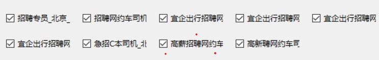

# boss打招呼小工具的使用教程
## 首先进入代码所在文件夹
      在文件夹中找到（start_for_windows.bat)并双击打开
      此时弹出三个界面
* 可以先扫码登录boss，此时程序自动运行，按（帖子选项卡1）所勾选的帖子按每个帖子所设置的时间段各打5个招呼，且此任务不可终止运行，关闭程序可强制终止
* 然后根据自己的需求使用该程序的不同功能，以下为该程序各按钮的功能介绍
### （开始翻简历）按钮
      点击按钮后，此时boss开始自动翻看被勾选的各个帖子的简历每个帖子翻看25个，所有被勾选的帖子都翻看完为一轮，一轮休息10分钟，休息结束后继续下一轮的翻看，第3轮结束后休息30分钟，如此循环
      *该任务可被（停止沟通和翻阅）终止任务*
### （开始打全部招呼）按钮
      点击按钮后，程序开始从第一个勾选的帖子开始打招呼，打满为止，再进行下一个帖子的打招呼任务，直至打满所有被勾选的帖子结束，为工作完成
      *该任务可被（停止沟通和翻阅）终止任务*
### （再打5个招呼）按钮
      点击按钮后，程序开始从第一个勾选的帖子开始打招呼，每个帖子各打5个招呼，所有被勾选的帖子打完结束任务
      *该任务可被（停止沟通和翻阅）终止任务*
### （沟通已打招呼的）按钮
      点击按钮后，程序会把boss翻到沟通界面，然后筛选出第一个勾选的帖子，向下翻50个开始向沟通过的人打招呼打满250个，然后筛选出第二个被勾选的帖子，重复以上第一个帖子的打招呼步骤，以此类推，直至打满所有被勾选的帖子为止
      *该任务可被（停止沟通和翻阅）终止任务*
### （停止沟通和翻阅）按钮
      点击按钮后，程序会终止以上可以被终止的任务，以上可被终止的任务都以标有 *该任务可被（停止沟通和翻阅）终止任务*
### 帖子选项卡1
      在帖子选项卡中可以以勾选的方式选择需要被翻阅简历或沟通的帖子

### 帖子选项卡2
      在此选项卡可以点开可以更改每个帖子的具体筛选条件
      *其中（年龄）和（打招呼时间段）为可编辑选项，其余为勾选选项；（打招呼时间段）的时间段更改格式以08:00-5,10:00-5为例*

### （工具运行日志）按钮
      此选项可以查看程序当前正在运行的任务
